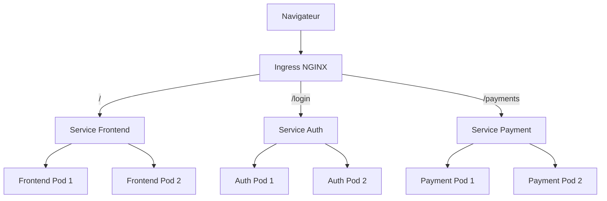

# KubeShop

KubeShop est une application web de commerce électronique composée de trois services conteneurisés avec Docker et déployés sur Kubernetes.

Ce projet démontre une migration vers une architecture microservices utilisant Minikube, des Deployments Kubernetes, des Services ClusterIP, des sondes de santé et un Ingress NGINX.

## Fonctionnalités

- Consultation de produits informatiques
- Simulation de connexion utilisateur
- Sélection d’un produit
- Simulation d’un paiement en dollars canadiens
- Création automatique d’un numéro de transaction
- Communication entre les services par Ingress
- Deux réplicas pour chaque composant
- Vérification automatique de l’état des Pods
- Routage centralisé avec `kubeshop.local`

## Technologies utilisées

- HTML, CSS et JavaScript
- Node.js 22
- Express.js
- NGINX
- Docker
- Kubernetes
- Minikube
- kubectl
- Ingress NGINX
- WSL2 et Ubuntu

## Architecture



L’Ingress distribue les requêtes selon la route demandée :

| Route | Service Kubernetes | Port | Fonction |
|---|---|---:|---|
| `/` | `kubeshop-frontend` | 80 | Interface web |
| `/login` | `kubeshop-auth` | 3001 | Authentification |
| `/payments` | `kubeshop-payment` | 3002 | Simulation de paiement |

## Structure du projet

```text
kubeshop/
├── frontend/
│   ├── css/
│   ├── js/
│   ├── Dockerfile
│   ├── index.html
│   └── nginx.conf
├── auth-service/
│   ├── Dockerfile
│   ├── package.json
│   └── server.js
├── payment-service/
│   ├── Dockerfile
│   ├── package.json
│   └── server.js
├── k8s/
│   ├── auth.yaml
│   ├── frontend.yaml
│   ├── ingress.yaml
│   └── payment.yaml
└── README.md
```

## Composants

### Frontend

Le frontend est une application statique HTML, CSS et JavaScript servie par NGINX.

- Image : `kubeshop-frontend:v6`
- Port du conteneur : `80`
- Route de santé : `/health`
- Nombre de réplicas : `2`

### Auth Service

Le service Auth est une API Node.js avec Express.

- Image : `kubeshop-auth:v1`
- Port : `3001`
- `GET /health` : vérifie l’état du service
- `POST /login` : simule une connexion
- Nombre de réplicas : `2`

La version actuelle accepte tout nom d’utilisateur et tout mot de passe non vides. Il s’agit d’une simulation destinée au projet.

### Payment Service

Le service Payment est une API Node.js avec Express.

- Image : `kubeshop-payment:v1`
- Port : `3002`
- `GET /health` : vérifie l’état du service
- `POST /payments` : simule un paiement
- Nombre de réplicas : `2`

Un identifiant de transaction au format `PAY-XXXXXXXX` est généré pour chaque paiement approuvé.

## Prérequis

Avant de démarrer le projet, installer :

- Docker Desktop
- WSL2 avec Ubuntu
- Minikube
- kubectl
- Git

## Installation

### 1. Cloner le dépôt

```bash
git clone https://github.com/SYou-dataengineer/kubeshop.git
cd kubeshop
```

### 2. Démarrer Minikube

```bash
minikube start --driver=docker
```

Vérifier le cluster :

```bash
minikube status
kubectl get nodes
```

Le nœud `minikube` doit avoir l’état `Ready`.

### 3. Activer Ingress

```bash
minikube addons enable ingress
```

Vérifier le contrôleur :

```bash
kubectl get pods -n ingress-nginx
```

## Construction des images Docker

Construire les trois images :

```bash
docker build -t kubeshop-frontend:v6 ./frontend
docker build -t kubeshop-auth:v1 ./auth-service
docker build -t kubeshop-payment:v1 ./payment-service
```

Charger les images dans Minikube :

```bash
minikube image load kubeshop-frontend:v6
minikube image load kubeshop-auth:v1
minikube image load kubeshop-payment:v1
```

Vérifier les images :

```bash
minikube image ls | grep kubeshop
```

## Déploiement Kubernetes

Appliquer tous les fichiers Kubernetes :

```bash
kubectl apply -f k8s/
```

Attendre la fin des déploiements :

```bash
kubectl rollout status deployment/kubeshop-frontend
kubectl rollout status deployment/kubeshop-auth
kubectl rollout status deployment/kubeshop-payment
```

Vérifier les ressources :

```bash
kubectl get deployments
kubectl get pods -o wide
kubectl get services
kubectl get ingress
```

Résultat attendu :

- 3 Deployments à `2/2`
- 6 Pods à l’état `Running`
- 3 Services KubeShop
- 1 Ingress nommé `kubeshop-ingress`

## Accès à l’application

### 1. Ouvrir le tunnel Ingress

```bash
kubectl port-forward -n ingress-nginx \
  service/ingress-nginx-controller 8081:80
```

Laisser ce terminal ouvert.

### 2. Configurer le fichier hosts de Windows

Ouvrir PowerShell en tant qu’administrateur et exécuter :

```powershell
Add-Content -Path "$env:WINDIR\System32\drivers\etc\hosts" -Value "`r`n127.0.0.1 kubeshop.local"
ipconfig /flushdns
```

### 3. Ouvrir l’application

Dans Chrome :

```text
http://kubeshop.local:8081
```

## Tests de l’Ingress

Garder le `port-forward` actif et ouvrir un deuxième terminal.

### Tester le frontend

```bash
curl --max-time 10 \
  -H "Host: kubeshop.local" \
  http://localhost:8081/health
```

Résultat attendu :

```text
KubeShop frontend is healthy
```

### Tester l’authentification

```bash
curl --max-time 10 \
  -H "Host: kubeshop.local" \
  -H "Content-Type: application/json" \
  -X POST http://localhost:8081/login \
  -d '{"username":"youness","password":"kubeshop123"}'
```

### Tester le paiement

```bash
curl --max-time 10 \
  -H "Host: kubeshop.local" \
  -H "Content-Type: application/json" \
  -X POST http://localhost:8081/payments \
  -d '{"product":"Moniteur 4K","amount":599.99}'
```

Le service doit retourner un paiement approuvé avec un identifiant semblable à :

```text
PAY-XXXXXXXX
```

## Résilience et santé

Chaque Deployment utilise :

- deux réplicas;
- une `readinessProbe`;
- une `livenessProbe`;
- un Service de type `ClusterIP`.

Les sondes utilisent la route `/health` pour déterminer si les conteneurs sont prêts et fonctionnels.

## Arrêter le projet

Arrêter le tunnel avec :

```text
Ctrl + C
```

Supprimer les ressources Kubernetes :

```bash
kubectl delete -f k8s/
```

Arrêter Minikube :

```bash
minikube stop
```

## Auteur

**Youness Safouani**

Projet de fin de session — migration d’une application conteneurisée vers Kubernetes.