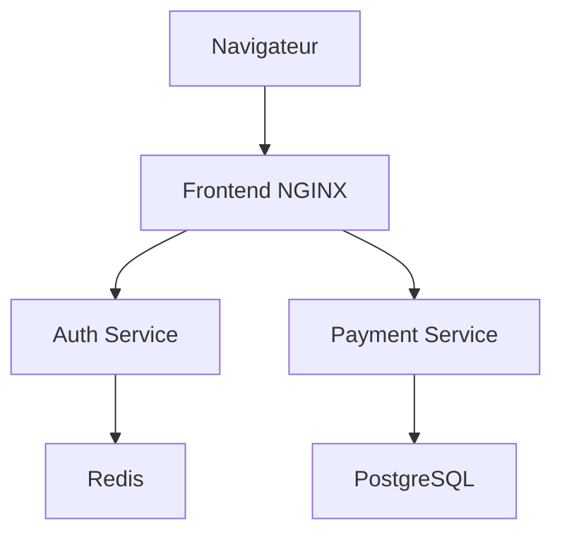

# KubeShop

KubeShop est une application web de commerce électronique conteneurisée avec Docker et déployée sur Kubernetes avec Minikube.

Le projet démontre une migration vers une architecture microservices comprenant un frontend NGINX, deux API Node.js, Redis, PostgreSQL, des volumes persistants et des mécanismes Kubernetes de résilience.

## Fonctionnalités

- Affichage de produits informatiques
- Simulation de connexion utilisateur
- Stockage des sessions dans Redis
- Simulation de paiements en dollars canadiens
- Enregistrement des transactions dans PostgreSQL
- Génération d’un identifiant `PAY-XXXXXXXX`
- Communication entre les services Kubernetes
- Répartition de charge entre plusieurs répliques
- Auto-réparation des pods
- Mise à l’échelle horizontale
- Persistance des données
- Vérification automatique de l’état des conteneurs

## Technologies utilisées

- HTML, CSS et JavaScript
- Node.js et Express
- NGINX
- Redis
- PostgreSQL
- Docker
- Kubernetes
- Minikube
- kubectl
- WSL2 et Ubuntu
- Git et GitHub

## Architecture



Le frontend agit également comme passerelle vers les API :

| Route | Destination | Fonction |
|---|---|---|
| `/` | Frontend NGINX | Interface web |
| `/health` | Frontend NGINX | État du frontend |
| `/login` | Auth Service | Connexion et création d’une session |
| `/payments` | Payment Service | Paiement et création d’une transaction |

## Composants Kubernetes

| Composant | Image | Répliques | Service | Port |
|---|---|---:|---|---:|
| Frontend | `kubeshop-frontend:k8s-v1` | 2 | `frontend` | 80 |
| Auth Service | `kubeshop-auth-service:k8s-v1` | 2 | `auth-service` | 3001 |
| Payment Service | `kubeshop-payment-service:k8s-v2` | 2 | `payment-service` | 3002 |
| Redis | Image officielle Redis | 1 | `redis` | 6379 |
| PostgreSQL | Image officielle PostgreSQL | 1 | `postgres` | 5432 |

Toutes les ressources sont déployées dans le namespace `kubeshop`.

## Stockage persistant

Deux PersistentVolumeClaims sont utilisés :

| Volume | Capacité | Utilisation |
|---|---:|---|
| `postgres-data` | 1 Gi | Transactions de paiement |
| `redis-data` | 1 Gi | Sessions et données Redis |

Les données restent disponibles après le remplacement des pods PostgreSQL ou Redis.

## Sondes de santé

Les trois services applicatifs possèdent :

- une `startupProbe`;
- une `readinessProbe`;
- une `livenessProbe`;
- des demandes et limites de ressources CPU et mémoire.

Les sondes utilisent la route `/health`.

## Structure du projet

```text
kubeshop/
├── frontend/
│   ├── css/
│   ├── js/
│   ├── Dockerfile
│   ├── index.html
│   └── nginx.conf
├── auth-service/
│   ├── Dockerfile
│   ├── package.json
│   └── server.js
├── payment-service/
│   ├── Dockerfile
│   ├── package.json
│   └── server.js
├── k8s/
│   └── base/
│       ├── 00-namespace.yaml
│       ├── 01-configmap.yaml
│       ├── 02-secret.yaml
│       ├── 10-postgres.yaml
│       ├── 11-redis.yaml
│       ├── 20-auth-service.yaml
│       ├── 21-payment-service.yaml
│       └── 22-frontend.yaml
├── docs/
│   └── images/
├── docker-compose.yml
├── .env.example
├── .gitignore
└── README.md
```

> Les manifestes validés de la version actuelle se trouvent dans `k8s/base/`.

## Prérequis

- Docker Desktop
- WSL2 avec Ubuntu
- Minikube
- kubectl
- Git

## Installation

### 1. Cloner le dépôt

```bash
git clone https://github.com/SYou-dataengineer/kubeshop.git
cd kubeshop
```

### 2. Démarrer Minikube

```bash
minikube start --driver=docker
minikube status
kubectl get nodes
```

Le nœud Minikube doit être `Ready`.

## Construction des images

```bash
docker build -t kubeshop-frontend:k8s-v1 ./frontend
docker build -t kubeshop-auth-service:k8s-v1 ./auth-service
docker build -t kubeshop-payment-service:k8s-v2 ./payment-service
```

Charger ensuite les images dans Minikube :

```bash
minikube image load kubeshop-frontend:k8s-v1
minikube image load kubeshop-auth-service:k8s-v1
minikube image load kubeshop-payment-service:k8s-v2
```

Vérification :

```bash
minikube image ls | grep kubeshop
```

Les manifestes utilisent `imagePullPolicy: Never`. Les images doivent donc être présentes localement dans Minikube.

## Déploiement Kubernetes

Créer le namespace :

```bash
kubectl apply -f k8s/base/00-namespace.yaml
```

Appliquer les manifestes :

```bash
kubectl apply -f k8s/base/
```

Attendre les déploiements :

```bash
kubectl rollout status deployment/postgres -n kubeshop
kubectl rollout status deployment/redis -n kubeshop
kubectl rollout status deployment/auth-service -n kubeshop
kubectl rollout status deployment/payment-service -n kubeshop
kubectl rollout status deployment/frontend -n kubeshop
```

Vérifier l’environnement :

```bash
kubectl get deployments,services,pods,pvc -n kubeshop
```

Résultat attendu :

- 5 déploiements disponibles;
- 8 pods `Running`;
- Frontend, Auth et Payment à `2/2`;
- PostgreSQL et Redis à `1/1`;
- 2 volumes persistants `Bound`.

## Accès à l’application

Ouvrir un port-forward vers le frontend :

```bash
kubectl port-forward -n kubeshop service/frontend 8082:80
```

L’application devient accessible à l’adresse :

```text
http://localhost:8082
```

Le terminal du port-forward doit rester ouvert.

## Tests fonctionnels

### Santé du frontend

```bash
curl -i http://localhost:8082/health
```

### Authentification

```bash
curl -i \
  -X POST \
  http://localhost:8082/login \
  -H 'Content-Type: application/json' \
  -d '{"username":"Youness","password":"test-kubeshop"}'
```

Une connexion réussie retourne notamment un `sessionToken`.

### Paiement

```bash
curl -i \
  -X POST \
  http://localhost:8082/payments \
  -H 'Content-Type: application/json' \
  -d '{"product":"Test Kubernetes","amount":29.99}'
```

Une transaction approuvée retourne un identifiant au format `PAY-XXXXXXXX`.

## Vérification de Redis

Afficher les clés :

```bash
kubectl exec \
  -n kubeshop \
  deployment/redis \
  -- redis-cli --scan
```

Les sessions sont enregistrées sous la forme :

```text
session:<identifiant>
```

## Vérification de PostgreSQL

```bash
kubectl exec \
  -n kubeshop \
  deployment/postgres \
  -- psql -U kubeshop -d kubeshop \
  -c "SELECT transaction_id, product, amount, currency, status FROM payments ORDER BY processed_at DESC LIMIT 5;"
```

## Test d’auto-réparation

Afficher les pods Payment :

```bash
kubectl get pods \
  -n kubeshop \
  -l app=kubeshop-payment-service
```

Supprimer l’un des deux pods :

```bash
kubectl delete pod \
  -n kubeshop \
  NOM_DU_POD_PAYMENT
```

Surveiller son remplacement :

```bash
kubectl get pods \
  -n kubeshop \
  -l app=kubeshop-payment-service \
  -w
```

Kubernetes crée automatiquement un nouveau pod afin de rétablir le déploiement à `2/2`.

## Test de mise à l’échelle

Passer le frontend de deux à trois répliques :

```bash
kubectl scale deployment/frontend \
  -n kubeshop \
  --replicas=3
```

Vérifier :

```bash
kubectl get deployment frontend -n kubeshop
kubectl get pods -n kubeshop -l app=kubeshop-frontend
```

Remettre ensuite la configuration normale :

```bash
kubectl scale deployment/frontend \
  -n kubeshop \
  --replicas=2
```

## Test de persistance PostgreSQL

Supprimer le pod PostgreSQL :

```bash
kubectl delete pod \
  -n kubeshop \
  -l app=kubeshop-postgres
```

Attendre son remplacement :

```bash
kubectl wait \
  -n kubeshop \
  --for=condition=Ready pod \
  -l app=kubeshop-postgres \
  --timeout=120s
```

Relancer ensuite la requête SQL. Les transactions doivent toujours être présentes grâce au volume `postgres-data`.

## Test de persistance Redis

Créer une valeur temporaire :

```bash
kubectl exec \
  -n kubeshop \
  deployment/redis \
  -- redis-cli SET kubeshop:persistence:test "donnee-conservee" EX 600
```

Supprimer le pod Redis :

```bash
kubectl delete pod \
  -n kubeshop \
  -l app=kubeshop-redis
```

Attendre son remplacement :

```bash
kubectl wait \
  -n kubeshop \
  --for=condition=Ready pod \
  -l app=kubeshop-redis \
  --timeout=120s
```

Vérifier la valeur :

```bash
kubectl exec \
  -n kubeshop \
  deployment/redis \
  -- redis-cli GET kubeshop:persistence:test
```

Le résultat attendu est :

```text
donnee-conservee
```

## Résultats validés

Les tests réalisés ont confirmé :

- le fonctionnement complet de l’authentification;
- la création des sessions dans Redis;
- la création des paiements dans PostgreSQL;
- la communication entre les microservices;
- l’auto-réparation des pods;
- la mise à l’échelle horizontale;
- la persistance des transactions PostgreSQL;
- la persistance des données Redis;
- le fonctionnement de huit pods sans redémarrage.

## Captures d’écran

### État du cluster Kubernetes


### Paiement KubeShop


## Limites et sécurité

Ce projet est une démonstration pédagogique :

- l’authentification accepte tout identifiant et mot de passe non vides;
- aucun paiement réel n’est traité;
- les secrets de démonstration ne doivent pas être utilisés en production;
- une solution de production devrait utiliser un gestionnaire de secrets et une stratégie de sauvegarde des bases de données.

## Auteur

**Youness Safouani**

AEC Développeur en mégadonnées
Collège de Bois-de-Boulogne
