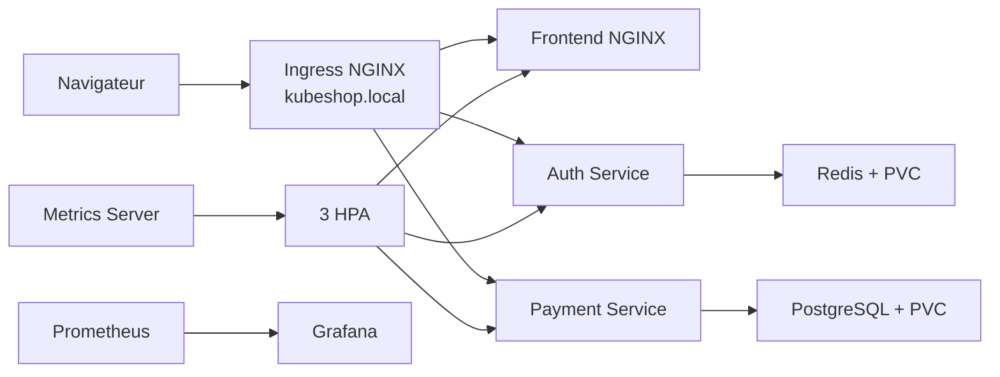
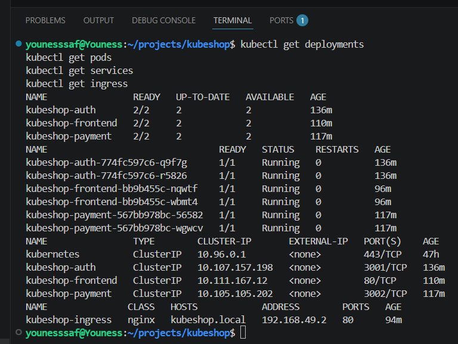
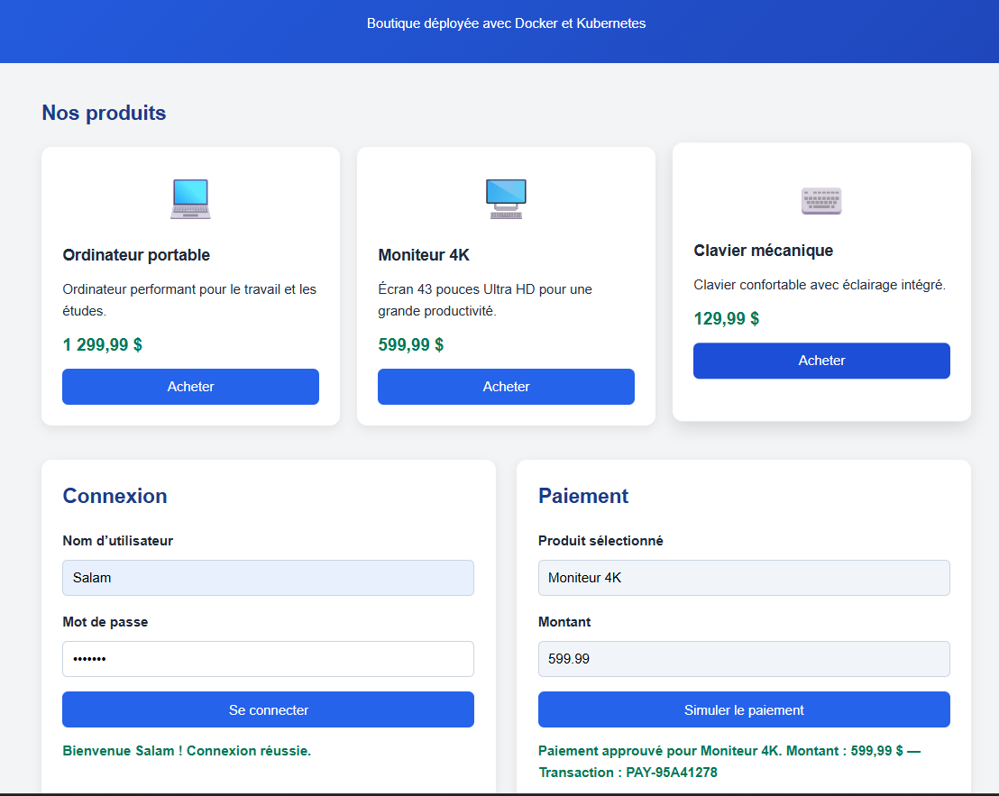

# KubeShop

KubeShop est une application web de commerce électronique conteneurisée avec Docker et déployée sur Kubernetes avec Minikube.

Le projet démontre une migration vers une architecture microservices comprenant un frontend NGINX, deux API Node.js, Redis, PostgreSQL, des volumes persistants, un Ingress, trois Horizontal Pod Autoscalers et une pile d’observabilité Prometheus/Grafana.

## Fonctionnalités

- Affichage de produits informatiques
- Simulation de connexion utilisateur
- Stockage des sessions dans Redis
- Simulation de paiements en dollars canadiens
- Enregistrement des transactions dans PostgreSQL
- Génération d’un identifiant `PAY-XXXXXXXX`
- Communication entre les services Kubernetes
- Point d’entrée unique avec Ingress NGINX
- Répartition de charge entre plusieurs répliques
- Auto-réparation des pods
- Mise à l’échelle horizontale automatique selon le CPU
- Persistance des données
- Vérification automatique de l’état des conteneurs
- Collecte des métriques avec Prometheus
- Visualisation du CPU et de la mémoire avec Grafana

## Technologies utilisées

- HTML, CSS et JavaScript
- Node.js et Express
- NGINX
- Redis
- PostgreSQL
- Docker et Docker Compose
- Kubernetes
- Minikube
- kubectl
- Ingress NGINX
- Metrics Server
- Helm
- Prometheus, Grafana et Alertmanager
- WSL2 et Ubuntu
- Git et GitHub

## Architecture



L’Ingress constitue le point d’entrée principal :

| Route | Destination | Fonction |
| --- | --- | --- |
| `/` | Frontend NGINX | Interface web |
| `/health` | Frontend NGINX | État du frontend |
| `/login` | Auth Service | Connexion et création d’une session |
| `/payments` | Payment Service | Paiement et création d’une transaction |

## Composants Kubernetes

| Composant | Image | Répliques minimales | Service | Port |
| --- | --- | ---: | --- | ---: |
| Frontend | `kubeshop-frontend:k8s-v1` | 2 | `frontend` | 80 |
| Auth Service | `kubeshop-auth-service:k8s-v1` | 2 | `auth-service` | 3001 |
| Payment Service | `kubeshop-payment-service:k8s-v2` | 2 | `payment-service` | 3002 |
| Redis | Image officielle Redis | 1 | `redis` | 6379 |
| PostgreSQL | Image officielle PostgreSQL | 1 | `postgres` | 5432 |

Toutes les ressources applicatives sont déployées dans le namespace `kubeshop`.

Les trois services applicatifs possèdent chacun un HPA :

| HPA | Minimum | Maximum | Cible CPU |
| --- | ---: | ---: | ---: |
| `frontend-hpa` | 2 | 5 | 50 % |
| `auth-service-hpa` | 2 | 5 | 50 % |
| `payment-service-hpa` | 2 | 5 | 50 % |

## Stockage persistant

Deux PersistentVolumeClaims applicatifs sont utilisés :

| Volume | Capacité | Utilisation |
| --- | ---: | --- |
| `postgres-data` | 1 Gi | Transactions de paiement |
| `redis-data` | 1 Gi | Sessions et données Redis |

La pile de monitoring ajoute également un volume Grafana de 1 Gi et un volume Prometheus de 5 Gi. Les données applicatives restent disponibles après le remplacement des pods PostgreSQL ou Redis.

## Sondes de santé

Les trois services applicatifs possèdent :

- une `startupProbe`;
- une `readinessProbe`;
- une `livenessProbe`;
- des demandes et limites de ressources CPU et mémoire.

Les sondes utilisent la route `/health`. Les demandes CPU sont également nécessaires au calcul du pourcentage utilisé par les HPA.

## Structure du projet

```text
kubeshop/
├── frontend/
│   ├── css/
│   ├── js/
│   ├── Dockerfile
│   ├── index.html
│   └── nginx.conf
├── auth-service/
│   ├── Dockerfile
│   ├── package.json
│   └── server.js
├── payment-service/
│   ├── Dockerfile
│   ├── package.json
│   └── server.js
├── k8s/
│   ├── base/
│   │   ├── 00-namespace.yaml
│   │   ├── 01-configmap.yaml
│   │   ├── 02-secret.yaml
│   │   ├── 10-postgres.yaml
│   │   ├── 11-redis.yaml
│   │   ├── 20-auth-service.yaml
│   │   ├── 21-payment-service.yaml
│   │   ├── 22-frontend.yaml
│   │   ├── 30-ingress.yaml
│   │   └── 31-hpa.yaml
│   └── monitoring/
│       ├── kubeshop-monitoring-dashboard.json
│       └── values.yaml
├── docs/
│   └── images/
├── docker-compose.yml
├── .env.example
├── .gitignore
└── README.md
```

## Environnement validé

Le projet final a été validé avec :

- Windows 11;
- WSL2 et Ubuntu 24.04;
- Docker Desktop avec le pilote Docker de Minikube;
- Minikube 1.35.1;
- kubectl 1.36.3;
- le chart Helm `kube-prometheus-stack` 88.2.0.

Des versions plus récentes compatibles peuvent aussi fonctionner, mais la version du chart de monitoring est épinglée pour rendre l’installation reproductible.

## Prérequis

- Docker Desktop avec l’intégration WSL2 activée
- WSL2 avec Ubuntu
- Minikube
- kubectl
- Helm 3
- Git
- au moins 4 CPU et 8 Go de mémoire recommandés pour exécuter l’application et toute la pile de monitoring

Vérifier les outils dans le terminal Ubuntu de VS Code :

```bash
docker --version
minikube version
kubectl version --client
helm version
git --version
```

## Installation complète

Toutes les commandes `bash` suivantes doivent être exécutées dans le terminal Ubuntu de VS Code, à la racine du dépôt.

### 1. Cloner le dépôt

```bash
git clone https://github.com/SYou-dataengineer/kubeshop.git
cd kubeshop
```

### 2. Validation locale avec Docker Compose

Cette étape confirme le fonctionnement des cinq services avant leur migration dans Kubernetes :

```bash
cp .env.example .env
docker compose up --build -d
docker compose ps
curl -i http://localhost:8080/health
```

Arrêter ensuite l’environnement Compose :

```bash
docker compose down
```

Les volumes Compose sont conservés, sauf si l’option `--volumes` est ajoutée.

### 3. Démarrer Minikube

Pour disposer de ressources suffisantes pour Prometheus et Grafana :

```bash
minikube start --driver=docker --cpus=4 --memory=8192
minikube status
kubectl get nodes
```

Le nœud Minikube doit être `Ready`.

### 4. Activer Ingress et Metrics Server

```bash
minikube addons enable ingress
minikube addons enable metrics-server

kubectl rollout status deployment/ingress-nginx-controller \
  -n ingress-nginx \
  --timeout=180s

kubectl rollout status deployment/metrics-server \
  -n kube-system \
  --timeout=180s
```

Vérifier les addons :

```bash
minikube addons list | grep -E 'ingress|metrics-server'
kubectl get pods -n ingress-nginx
kubectl top nodes
```

`kubectl top nodes` peut demander une ou deux minutes avant d’afficher les premières métriques.

### 5. Construire et charger les images

```bash
docker build -t kubeshop-frontend:k8s-v1 ./frontend
docker build -t kubeshop-auth-service:k8s-v1 ./auth-service
docker build -t kubeshop-payment-service:k8s-v2 ./payment-service

minikube image load kubeshop-frontend:k8s-v1
minikube image load kubeshop-auth-service:k8s-v1
minikube image load kubeshop-payment-service:k8s-v2
```

Vérification :

```bash
minikube image ls | grep kubeshop
```

Les manifestes utilisent `imagePullPolicy: Never`. Les trois images doivent donc être présentes localement dans Minikube.

### 6. Déployer KubeShop, l’Ingress et les HPA

Créer d’abord le namespace, puis appliquer tous les manifestes :

```bash
kubectl apply -f k8s/base/00-namespace.yaml
kubectl apply -f k8s/base/
```

Le dossier `k8s/base/` inclut `30-ingress.yaml` et `31-hpa.yaml`; aucune création manuelle supplémentaire n’est nécessaire.

Attendre les cinq déploiements :

```bash
kubectl rollout status deployment/postgres -n kubeshop --timeout=180s
kubectl rollout status deployment/redis -n kubeshop --timeout=180s
kubectl rollout status deployment/auth-service -n kubeshop --timeout=180s
kubectl rollout status deployment/payment-service -n kubeshop --timeout=180s
kubectl rollout status deployment/frontend -n kubeshop --timeout=180s
```

Vérifier l’environnement :

```bash
kubectl get deployments,services,pods,pvc -n kubeshop
kubectl get ingress,hpa -n kubeshop
kubectl top pods -n kubeshop
```

Résultat attendu sans charge :

- 5 Deployments disponibles;
- 8 pods `Running`;
- Frontend, Auth et Payment à `2/2`;
- PostgreSQL et Redis à `1/1`;
- 5 Services `ClusterIP`;
- 2 volumes persistants `Bound`;
- 1 Ingress pour `kubeshop.local`;
- 3 HPA avec une cible CPU de 50 % et 2 répliques minimales.

Les colonnes CPU des HPA peuvent afficher `<unknown>` pendant les premières minutes, jusqu’à ce que Metrics Server fournisse ses premiers échantillons.

## Accès principal par Ingress

### 1. Obtenir l’adresse IP de Minikube

Dans Ubuntu/WSL :

```bash
minikube ip
```

### 2. Associer l’adresse à `kubeshop.local`

Pour utiliser `curl` depuis WSL :

```bash
echo "$(minikube ip) kubeshop.local" | sudo tee -a /etc/hosts
```

Pour ouvrir l’application dans Chrome sous Windows, ouvrir le Bloc-notes **en tant qu’administrateur**, puis ajouter la même ligne dans :

```text
C:\Windows\System32\drivers\etc\hosts
```

Exemple :

```text
192.168.49.2 kubeshop.local
```

Utiliser la valeur retournée par `minikube ip`. Si une ancienne ligne `kubeshop.local` existe, la remplacer plutôt que d’en ajouter une deuxième.

### 3. Vérifier l’Ingress

```bash
kubectl get ingress kubeshop-ingress -n kubeshop
curl -i http://kubeshop.local/health
```

L’application est accessible à l’adresse :

```text
http://kubeshop.local
```

Le `port-forward` n’est pas nécessaire pour l’utilisation normale. Il reste une solution de dépannage secondaire :

```bash
kubectl port-forward -n kubeshop service/frontend 8082:80
```

## Tests fonctionnels par Ingress

### Santé du frontend

```bash
curl -i http://kubeshop.local/health
```

### Authentification

```bash
curl -i \
  -X POST \
  http://kubeshop.local/login \
  -H 'Content-Type: application/json' \
  -d '{"username":"Youness","password":"test-kubeshop"}'
```

Une connexion réussie retourne notamment un `sessionToken` et une durée de vie de 3 600 secondes.

### Paiement

```bash
curl -i \
  -X POST \
  http://kubeshop.local/payments \
  -H 'Content-Type: application/json' \
  -d '{"product":"Test Kubernetes","amount":29.99}'
```

Une transaction approuvée retourne un identifiant au format `PAY-XXXXXXXX`.

## Vérification de Redis

Afficher les clés :

```bash
kubectl exec \
  -n kubeshop \
  deployment/redis \
  -- redis-cli --scan
```

Les sessions sont enregistrées sous la forme :

```text
session:<identifiant>
```

## Vérification de PostgreSQL

```bash
kubectl exec \
  -n kubeshop \
  deployment/postgres \
  -- psql -U kubeshop -d kubeshop \
  -c "SELECT transaction_id, product, amount, currency, status FROM payments ORDER BY processed_at DESC LIMIT 5;"
```

## Test d’auto-réparation

Afficher les pods Payment :

```bash
kubectl get pods \
  -n kubeshop \
  -l app=kubeshop-payment-service
```

Supprimer l’un des deux pods :

```bash
kubectl delete pod \
  -n kubeshop \
  NOM_DU_POD_PAYMENT
```

Surveiller son remplacement :

```bash
kubectl get pods \
  -n kubeshop \
  -l app=kubeshop-payment-service \
  -w
```

Kubernetes crée automatiquement un nouveau pod afin de rétablir le déploiement à `2/2`.

## Test reproductible du HPA

Le fichier `k8s/base/31-hpa.yaml` configure trois HPA. Le scénario suivant teste celui du frontend.

### 1. Confirmer les métriques et l’état initial

```bash
kubectl top pods -n kubeshop
kubectl get hpa frontend-hpa -n kubeshop
```

### 2. Générer une charge continue

Dans un premier terminal Ubuntu :

```bash
kubectl run -n kubeshop -i --tty load-generator --rm \
  --image=busybox:1.36 \
  --restart=Never \
  -- /bin/sh -c \
  'while sleep 0.01; do wget -q -O- http://frontend/ >/dev/null; done'
```

### 3. Observer la montée automatique

Dans un deuxième terminal :

```bash
kubectl get hpa frontend-hpa -n kubeshop --watch
```

Dans un troisième terminal :

```bash
kubectl get pods -n kubeshop -l app=kubeshop-frontend --watch
```

Lorsque l’utilisation moyenne dépasse la cible de 50 %, le HPA ajoute des pods jusqu’à un maximum de 5. Lors du test validé, le frontend est passé automatiquement de `2 → 5` pods.

### 4. Arrêter la charge et observer la descente

Appuyer sur `Ctrl+C` dans le terminal du générateur de charge. Le pod `load-generator` est supprimé automatiquement grâce à l’option `--rm`.

Continuer à observer :

```bash
kubectl get hpa frontend-hpa -n kubeshop --watch
```

Après la baisse du CPU et la fenêtre de stabilisation, le frontend revient progressivement à 2 pods. Le temps exact dépend de la collecte des métriques et peut prendre quelques minutes.

## Installation de Prometheus et Grafana

La configuration finale se trouve dans `k8s/monitoring/values.yaml`. Elle active Prometheus, Grafana et Alertmanager, conserve sept jours de métriques et configure des volumes persistants pour Prometheus et Grafana.

### 1. Ajouter le dépôt Helm officiel

```bash
helm repo add prometheus-community \
  https://prometheus-community.github.io/helm-charts

helm repo update
```

### 2. Installer la pile de monitoring

```bash
helm upgrade --install monitoring \
  prometheus-community/kube-prometheus-stack \
  --namespace monitoring \
  --create-namespace \
  --version 88.2.0 \
  --values k8s/monitoring/values.yaml \
  --wait \
  --timeout 10m
```

La commande est idempotente : elle installe la pile la première fois et applique les mises à jour lors des exécutions suivantes.

### 3. Vérifier l’installation

```bash
helm list -n monitoring
kubectl get pods -n monitoring
kubectl get pvc -n monitoring
```

Les composants principaux doivent être `Running`, notamment Prometheus, Grafana, Alertmanager, Prometheus Operator, kube-state-metrics et node-exporter.

## Accès à Grafana et import du dashboard

### 1. Récupérer le mot de passe administrateur

```bash
kubectl get secret monitoring-grafana \
  -n monitoring \
  -o jsonpath='{.data.admin-password}' \
  | base64 --decode
echo
```

Le nom d’utilisateur est :

```text
admin
```

### 2. Ouvrir Grafana

Dans un terminal qui restera ouvert :

```bash
kubectl port-forward \
  -n monitoring \
  service/monitoring-grafana \
  3000:80
```

Ouvrir ensuite :

```text
http://localhost:3000
```

### 3. Importer le dashboard KubeShop

Dans Grafana :

1. ouvrir **Dashboards**;
2. choisir **New**, puis **Import**;
3. téléverser `k8s/monitoring/kubeshop-monitoring-dashboard.json`;
4. sélectionner la source de données Prometheus si Grafana la demande;
5. cliquer sur **Import**.

Le dashboard **KubeShop Monitoring** affiche :

- l’utilisation CPU par namespace, en cœurs;
- l’utilisation mémoire par namespace;
- une fenêtre temporelle initiale de six heures.

## Vérification directe de Prometheus

Dans un autre terminal :

```bash
kubectl port-forward \
  -n monitoring \
  service/monitoring-kube-prometheus-prometheus \
  9090:9090
```

Ouvrir :

```text
http://localhost:9090/targets
```

Les cibles utilisées par le dashboard, notamment les métriques kubelet et cAdvisor, doivent être en état `UP`.

## Tests de persistance

### PostgreSQL

Supprimer le pod PostgreSQL :

```bash
kubectl delete pod \
  -n kubeshop \
  -l app=kubeshop-postgres
```

Attendre son remplacement :

```bash
kubectl wait \
  -n kubeshop \
  --for=condition=Ready pod \
  -l app=kubeshop-postgres \
  --timeout=120s
```

Relancer ensuite la requête SQL. Les transactions doivent toujours être présentes grâce au volume `postgres-data`.

### Redis

Créer une valeur temporaire :

```bash
kubectl exec \
  -n kubeshop \
  deployment/redis \
  -- redis-cli SET kubeshop:persistence:test "donnee-conservee" EX 600
```

Supprimer le pod Redis :

```bash
kubectl delete pod \
  -n kubeshop \
  -l app=kubeshop-redis
```

Attendre son remplacement :

```bash
kubectl wait \
  -n kubeshop \
  --for=condition=Ready pod \
  -l app=kubeshop-redis \
  --timeout=120s
```

Vérifier la valeur :

```bash
kubectl exec \
  -n kubeshop \
  deployment/redis \
  -- redis-cli GET kubeshop:persistence:test
```

Le résultat attendu est :

```text
donnee-conservee
```

## Validation finale

```bash
minikube status
kubectl get deployments,services,pods,pvc,ingress,hpa -n kubeshop
kubectl top pods -n kubeshop
kubectl get pods,pvc -n monitoring
helm status monitoring -n monitoring
curl -i http://kubeshop.local/health
git status --short
git log -5 --oneline
```

Sans charge active, le résultat final attendu est :

- 5 Deployments et 8 pods applicatifs `Running`;
- 5 Services `ClusterIP`;
- 2 PVC applicatifs `Bound`;
- l’Ingress `kubeshop.local` opérationnel;
- 3 HPA actifs avec 2 répliques minimales;
- Metrics Server capable de fournir `kubectl top`;
- Prometheus, Grafana et Alertmanager opérationnels;
- le dashboard KubeShop capable d’afficher le CPU et la mémoire;
- un dépôt Git propre.

## Dépannage

### L’Ingress ne répond pas

```bash
minikube addons enable ingress
kubectl get pods -n ingress-nginx
kubectl get ingress -n kubeshop
curl -H 'Host: kubeshop.local' "http://$(minikube ip)/health"
```

Si la dernière commande fonctionne, corriger l’entrée `kubeshop.local` dans le fichier `hosts` de Windows ou de WSL.

### Le HPA affiche `<unknown>`

```bash
minikube addons enable metrics-server
kubectl get apiservice v1beta1.metrics.k8s.io
kubectl rollout status deployment/metrics-server -n kube-system
kubectl top pods -n kubeshop
kubectl describe hpa frontend-hpa -n kubeshop
```

Attendre ensuite une ou deux minutes pour la collecte initiale.

### Grafana affiche « No data »

```bash
kubectl get pods -n monitoring
kubectl get svc -n monitoring
kubectl port-forward \
  -n monitoring \
  service/monitoring-kube-prometheus-prometheus \
  9090:9090
```

Vérifier `http://localhost:9090/targets`, confirmer que les cibles sont `UP`, puis vérifier que le dashboard utilise la source de données Prometheus et une période incluant les dernières minutes.

## Résultats validés

Les tests réalisés ont confirmé :

- le fonctionnement complet de l’authentification;
- la création des sessions dans Redis;
- la création des paiements dans PostgreSQL;
- la communication entre les microservices;
- l’accès aux trois routes par `kubeshop.local`;
- l’auto-réparation des pods;
- la mise à l’échelle manuelle de 2 à 3 répliques;
- la mise à l’échelle automatique HPA du frontend de `2 → 5 → 2`;
- la persistance des transactions PostgreSQL;
- la persistance des données Redis;
- le fonctionnement de huit pods sans charge;
- la collecte des métriques par Prometheus;
- l’affichage du CPU et de la mémoire dans Grafana.

## Captures d’écran

### État du cluster Kubernetes



### Paiement KubeShop



## Limites et sécurité

Ce projet est une démonstration pédagogique :

- l’authentification accepte tout identifiant et mot de passe non vides;
- aucun paiement réel n’est traité;
- les secrets de démonstration ne doivent pas être utilisés en production;
- une solution de production devrait utiliser un gestionnaire de secrets, TLS, une stratégie de sauvegarde et un cluster à plusieurs nœuds.

## Références officielles

- [Minikube — Ingress](https://minikube.sigs.k8s.io/docs/start/)
- [Kubernetes — HorizontalPodAutoscaler](https://kubernetes.io/docs/tasks/run-application/horizontal-pod-autoscale-walkthrough/)
- [Prometheus Community — Helm Charts](https://github.com/prometheus-community/helm-charts)
- [kube-prometheus-stack](https://github.com/prometheus-community/helm-charts/tree/main/charts/kube-prometheus-stack)

## Auteur

Youness Safouani

AEC Développeur en mégadonnées  
Collège de Bois-de-Boulogne

## Extension Big Data et analytique

Le projet transactionnel et Kubernetes est complété par un pipeline analytique temps réel et Batch.

- [Guide complet Big Data](docs/BIG_DATA_GUIDE.md)
- [Guide Power BI](docs/powerbi/POWER_BI_GUIDE.md)
- Validation automatique : `pwsh -NoProfile -ExecutionPolicy Bypass -File .\scripts\validate-project.ps1`

La plateforme Big Data complète utilise `docker-compose.yml` et `docker-compose.bigdata.yml`.
