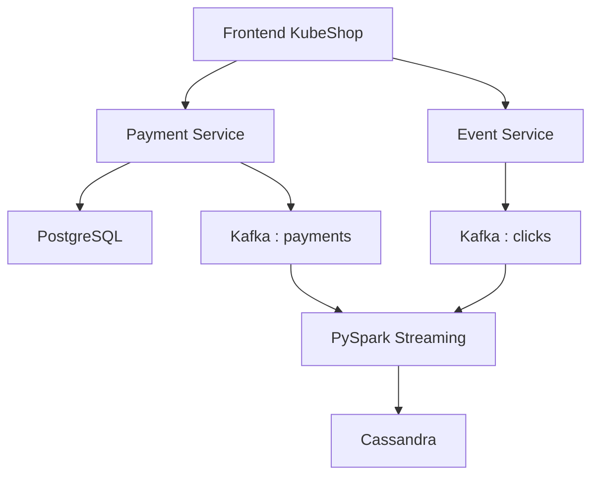
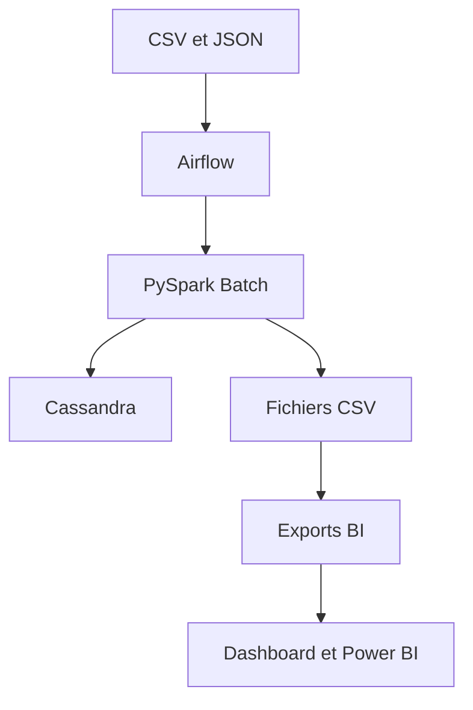

# Guide Big Data — KubeShop

## 1. Objectif

Cette extension transforme KubeShop en plateforme analytique capable de traiter les événements d'une boutique en ligne en temps réel et en mode Batch.

Elle permet de :

- publier les paiements et les clics dans Kafka;
- traiter les événements avec PySpark Structured Streaming;
- conserver les indicateurs temps réel dans Cassandra;
- orchestrer les traitements Batch avec Apache Airflow;
- produire des KPI, des recommandations et des fichiers prêts à importer dans Power BI;
- présenter les résultats dans un tableau de bord analytique.

## 2. Périmètre de déploiement

Le dépôt contient deux périmètres complémentaires :

- le projet KubeShop original et ses manifests Kubernetes;
- l'extension Big Data complète, validée localement avec les deux fichiers Docker Compose.

Le démarrage de la plateforme Big Data utilise donc toujours :

```powershell
docker compose -f .\docker-compose.yml -f .\docker-compose.bigdata.yml up -d --build
```

Les manifests du dossier `k8s/` décrivent la base Kubernetes historique. Ils ne déploient pas Kafka, Cassandra, Airflow ni le tableau de bord analytique.

## 3. Architecture

### Flux temps réel



Deux contrats d'événements sont traités :

- `payment_completed` : transaction, produit, montant, devise, statut et date;
- `product_clicked` : produit, prix, devise, session et date.

Les montants agrégés dans Cassandra sont conservés en cents afin d'éviter les erreurs d'arrondi monétaire.

### Flux Batch et BI



Le DAG `kubeshop_batch_analytics` exécute cinq tâches :

1. `validate_source_files`
2. `run_pyspark_batch`
3. `validate_batch_output_files`
4. `build_powerbi_exports`
5. `validate_powerbi_output_files`

## 4. Composants

| Composant | Fonction |
|---|---|
| Frontend | Boutique et génération des clics |
| Auth Service | Simulation de l'authentification |
| Payment Service | PostgreSQL et publication Kafka |
| Event Service | Publication des clics dans Kafka |
| PostgreSQL | Transactions |
| Redis | Sessions |
| Kafka | Topics `payments` et `clicks` |
| PySpark Streaming | Agrégations temps réel |
| Cassandra | Métriques analytiques |
| Airflow | Orchestration quotidienne du Batch |
| PySpark Batch | Traitement des sources CSV et JSON |
| Analytics Dashboard | KPI et recommandations |
| Power BI | Analyse des exports CSV |

## 5. Prérequis

- Windows avec PowerShell;
- Docker Desktop démarré;
- Docker Compose disponible;
- au moins 8 Go de mémoire attribuée à Docker;
- ports `3001`, `3002`, `3003`, `8080`, `8081`, `8082`, `9042` et `9092` disponibles.

## 6. Démarrage complet

Depuis la racine du dépôt :

```powershell
docker compose -f .\docker-compose.yml -f .\docker-compose.bigdata.yml config --quiet
docker compose -f .\docker-compose.yml -f .\docker-compose.bigdata.yml up -d --build
docker compose -f .\docker-compose.yml -f .\docker-compose.bigdata.yml ps
```

Cassandra et Airflow peuvent prendre quelques minutes avant de devenir `healthy`.

## 7. Adresses utiles

| Service | Adresse |
|---|---|
| Boutique KubeShop | `http://localhost:8080` |
| Auth Service | `http://localhost:3001/health` |
| Payment Service | `http://localhost:3002/health` |
| Event Service | `http://localhost:3003/health` |
| Airflow | `http://localhost:8081` |
| Tableau de bord | `http://localhost:8082` |
| Kafka | `localhost:9092` |
| Cassandra | `localhost:9042` |

Pour récupérer le mot de passe administrateur local généré par Airflow :

```powershell
docker compose -f .\docker-compose.yml -f .\docker-compose.bigdata.yml exec airflow sh -c "cat /opt/airflow/standalone_admin_password.txt"
```

Ne jamais publier ce mot de passe dans GitHub, une capture d'écran ou la présentation.

## 8. Démonstration temps réel

Créer un paiement :

```powershell
Invoke-RestMethod -Method Post -Uri http://localhost:3002/payments -ContentType "application/json" -Body '{"product":"Laptop Demo","amount":500.00}' | ConvertTo-Json
```

La réponse doit contenir `success: true`, `eventPublished: true` et `kafkaTopic: payments`.

Afficher un événement Kafka :

```powershell
docker compose exec kafka /opt/kafka/bin/kafka-console-consumer.sh --bootstrap-server kafka:19092 --topic payments --from-beginning --max-messages 1 --timeout-ms 10000
```

Vérifier les ventes temps réel :

```powershell
docker compose -f .\docker-compose.yml -f .\docker-compose.bigdata.yml exec cassandra cqlsh -e "SELECT product, sales_count, total_revenue_cents FROM kubeshop_analytics.product_metrics;"
```

Pour tester les clics, ouvrir `http://localhost:8080`, sélectionner un produit, puis exécuter :

```powershell
docker compose exec kafka /opt/kafka/bin/kafka-console-consumer.sh --bootstrap-server kafka:19092 --topic clicks --from-beginning --max-messages 1 --timeout-ms 10000
docker compose -f .\docker-compose.yml -f .\docker-compose.bigdata.yml exec cassandra cqlsh -e "SELECT product, clicks_count FROM kubeshop_analytics.product_click_metrics;"
```

## 9. Démonstration Batch

Déclencher le DAG :

```powershell
docker compose -f .\docker-compose.yml -f .\docker-compose.bigdata.yml exec airflow airflow dags trigger kubeshop_batch_analytics
docker compose -f .\docker-compose.yml -f .\docker-compose.bigdata.yml exec airflow airflow dags list-runs -d kubeshop_batch_analytics
```

L'exécution la plus récente doit avoir l'état `success`.

Vérifier Cassandra :

```powershell
docker compose -f .\docker-compose.yml -f .\docker-compose.bigdata.yml exec cassandra cqlsh -e "SELECT * FROM kubeshop_analytics.batch_product_metrics;"
docker compose -f .\docker-compose.yml -f .\docker-compose.bigdata.yml exec cassandra cqlsh -e "SELECT * FROM kubeshop_analytics.batch_daily_sales;"
```

Avec le jeu de données fourni, le Batch produit 14 commandes approuvées, 24 unités et `10 619,76 $` de revenu sur huit journées.

## 10. Exports analytiques

Le DAG actualise les exemples versionnés dans `data/output/` :

| Fichier | Contenu |
|---|---|
| `product_metrics.csv` | Ventes et revenus Batch par produit |
| `daily_sales.csv` | Ventes quotidiennes |
| `dashboard_kpis.csv` | KPI principaux |
| `product_analytics.csv` | Vue combinée Batch et temps réel |
| `recommendations.csv` | Classement et recommandations |
| `dashboard_summary.json` | Données du tableau de bord |
| `README.md` | Dictionnaire des fichiers produits |

Ces fichiers sont inclus comme résultats reproductibles de démonstration et sont régénérés à chaque exécution réussie du DAG.

Pour Power BI Desktop, importer principalement `dashboard_kpis.csv`, `product_analytics.csv`, `daily_sales.csv` et `recommendations.csv`. Il s'agit d'exports prêts à importer; aucun fichier `.pbix` n'est inclus. Voir `docs/powerbi/POWER_BI_GUIDE.md`.

## 11. Validation automatique

Exécuter le contrôle non destructif :

```powershell
pwsh -NoProfile -ExecutionPolicy Bypass -File .\scripts\validate-project.ps1
```

Le script vérifie Compose, les 11 services, les six URL, les topics Kafka, quatre tables Cassandra, Airflow et les fichiers BI.

## 12. Journaux et dépannage

```powershell
docker compose -f .\docker-compose.yml -f .\docker-compose.bigdata.yml logs -f stream-processor
docker compose -f .\docker-compose.yml -f .\docker-compose.bigdata.yml logs -f airflow
docker compose -f .\docker-compose.yml -f .\docker-compose.bigdata.yml logs -f payment-service
docker compose -f .\docker-compose.yml -f .\docker-compose.bigdata.yml logs -f event-service
```

Utiliser `Ctrl+C` pour quitter les journaux sans arrêter les conteneurs.

## 13. Arrêt et réinitialisation

Arrêter les conteneurs en conservant les volumes :

```powershell
docker compose -f .\docker-compose.yml -f .\docker-compose.bigdata.yml down
```

Redémarrer :

```powershell
docker compose -f .\docker-compose.yml -f .\docker-compose.bigdata.yml up -d
```

La commande suivante supprime PostgreSQL, Redis, Cassandra, les métadonnées Airflow et les checkpoints :

```powershell
docker compose -f .\docker-compose.yml -f .\docker-compose.bigdata.yml down -v
```

Elle doit uniquement être utilisée pour une réinitialisation complète volontaire.

## 14. Limites et sécurité

Cette démonstration locale utilise un seul broker Kafka, un seul nœud Cassandra et Airflow en mode autonome. L'authentification est simplifiée, les paiements sont simulés, les composants analytiques ne sont pas protégés par TLS et la publication PostgreSQL vers Kafka n'utilise pas d'outbox transactionnelle. Une solution de production devrait ajouter gestion des secrets, TLS, contrôle d'accès, réplication, sauvegardes, Schema Registry, Dead Letter Queue, supervision et stratégie d'idempotence.
